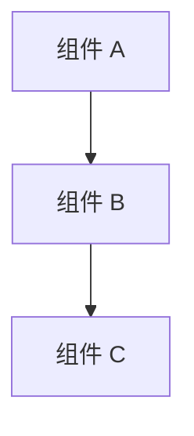

# 设计文档

## 概述

[对功能及其在整体系统中的位置进行高层次描述]

## 与指导文档的对齐

### 技术标准 (tech.md)
[说明设计如何遵循已记录的技术模式和标准]

### 项目结构 (structure.md)
[说明实现将如何遵循项目组织约定]

## 代码复用分析
[说明将利用、扩展或集成哪些现有代码]

### 可复用的现有组件
- **[组件/工具名称]**：[如何使用]
- **[服务/辅助工具名称]**：[如何扩展]

### 集成点
- **[现有系统/API]**：[新功能将如何集成]
- **[数据库/存储]**：[数据将如何连接到现有架构]

## 架构

[描述使用的整体架构和设计模式]

### 模块化设计原则
- **单文件职责**：每个文件应处理一个特定的关注点或领域
- **组件隔离**：创建小型、专注的组件，而不是大型单体文件
- **服务层分离**：分离数据访问、业务逻辑和表示层
- **工具模块化**：将工具拆分为专注的单一用途模块



## 组件和接口

### 组件 1
- **目的：** [该组件的功能]
- **接口：** [公共方法/API]
- **依赖：** [它依赖什么]
- **复用：** [它基于哪些现有组件/工具]

### 组件 2
- **目的：** [该组件的功能]
- **接口：** [公共方法/API]
- **依赖：** [它依赖什么]
- **复用：** [它基于哪些现有组件/工具]

## 数据模型

### 模型 1
```
[用你的语言定义 Model1 的结构]
- id: [唯一标识符类型]
- name: [字符串/文本类型]
- [根据需要添加其他属性]
```

### 模型 2
```
[用你的语言定义 Model2 的结构]
- id: [唯一标识符类型]
- [根据需要添加其他属性]
```

## 错误处理

### 错误场景
1. **场景 1：** [描述]
   - **处理方式：** [如何处理]
   - **用户影响：** [用户看到什么]

2. **场景 2：** [描述]
   - **处理方式：** [如何处理]
   - **用户影响：** [用户看到什么]

## 测试策略

### 单元测试
- [单元测试方法]
- [要测试的关键组件]

### 集成测试
- [集成测试方法]
- [要测试的关键流程]

### 端到端测试
- [E2E 测试方法]
- [要测试的用户场景]
